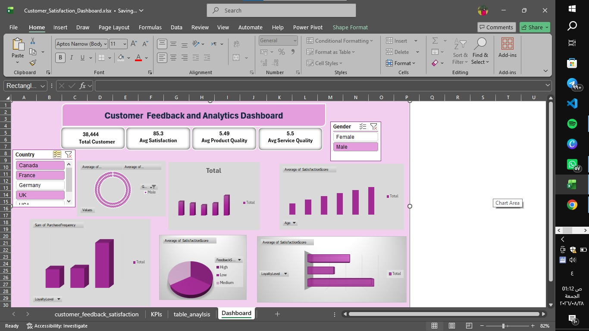

# 📊 Customer Feedback & Analytics Dashboard

An interactive Excel dashboard designed to analyze customer satisfaction levels, product quality, service evaluation, and demographic metrics across 38,000+ customer records.

---

## 📸 Dashboard Preview

---

## 🎯 Project Overview & Objective

The primary objective of this project is to provide actionable insights into customer behavior and satisfaction levels. By utilizing dynamic Excel tools, the dashboard breaks down customer scores based on demographic attributes and loyalty tiers to help improve overall service performance.

---

## 🛠️ Key Features & Excel Tools Used

* **Data Cleaning & Preparation:** Standardized raw dataset containing over 38k records for analytical modeling.
* **Pivot Tables & Aggregations:** Evaluated core KPIs including:
  * **Total Customers:** 38,444
  * **Average Satisfaction Score:** 85.3
  * **Average Product Quality:** 5.49
  * **Average Service Quality:** 5.5
* **Data Visualization:** Built dynamic Column, Pie, Donut, and Bar charts to display performance across age groups, loyalty levels, and genders.
* **Interactive Slicers:** Applied cross-filtering Slicers (Country, Gender, Loyalty Level) connected seamlessly to provide synchronized multi-variable dashboard filtering.

---

## 📁 Repository Structure
